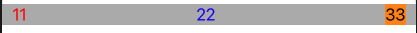
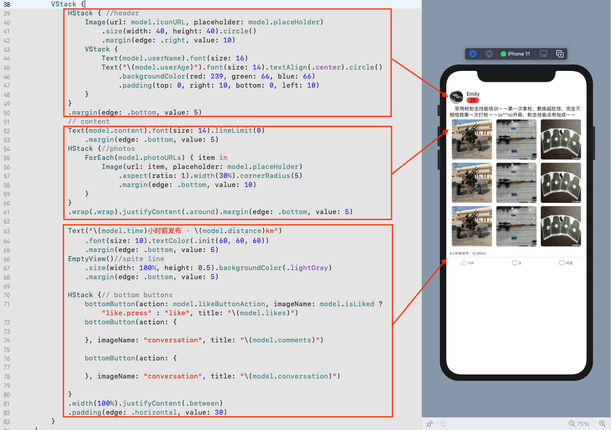
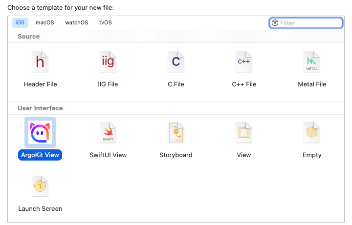

# ArgoKit

ArgoKit is a declarative and reactive Framework and based on UIKit, inspired by SwiftUI, compatible with iOS 11+.

## Introduction

- **Declarative** ArgoKit uses almost the same `DSL` as SwiftUI(e.g., `Text` `Button` `List` ).You simply describe the UI elements and Animation, and the framework takes care of the rest.

- **React** The created view automatically listens directly to streams and updates the DOM accordingly.

-  **Flexbox Layout** ArgoKit uses [Yoga](https://facebook.github.io/yoga/) as layout engine.


- **Preview and templating** ArgoKit uses the same preview approach as SwiftUI, and you can be easily developed through the template files.

## API Documentation

[API Documentation](https://momotech.github.io/argokit/)

## Usage

### Installation

```
pod 'ArgoKit'
pod 'ArgoKitPreview', :configuration => 'Debug'


post_integrate do |installer|
    installer.generated_pod_targets.each do |target|
      if target.name == "ArgoKitPreview"
        pod_dir = target.sandbox.pod_dir(target.name)
        require "#{pod_dir}/Source/Script/argokit_preview_config.rb"
        config_preview_files installer,target
      end
    end
end
```

#### Declarative

```swift
        HStack {
            Text("11")
                .textColor(.red)
            Text("22")
                .textColor(.blue)
            Text("33")
                .backgroundColor(.orange)
        }
        .justifyContent(.between)
        .padding(edge: .horizontal, value: 10)
        .backgroundColor(.lightGray)
```


#### Animation

```swift
        Text("Hello, ArgoKit!")
            .addAnimation {
                Animation(type: .rotation)
                    .duration(3.0)
                    .to(360)
                    .repeatForever(true)
                    .repeatCallback { (animation, count) in
                        print("[Animation] repeat count:\(count)")
                    }
                    .startCallback { animation in
                        print("[Animation] start")
                    }
                    .resumeCallback { animation in
                        print("[Animation] resume")
                    }
                    .pauseCallback { animation in
                        print("[Animation] pause")
                    }
                    .finishCallback { (animation, finished) in
                        print("[Animation] finish \(finished)")
                    }
        }
```


####  React 

- Auto Data Bind

```swift
class FeedCellModel {
   @Property var title: String = "is title"
   func getTitle() {
      self.title + " \(self.age)"
   }

   func titleAction() {
	model.title = "change title"
	model.age = 20
   }
}

// View
Text(model.getTitle())
   .onTapGesture(model.titleAction)
```

#### Preview


#### Tempalte 

